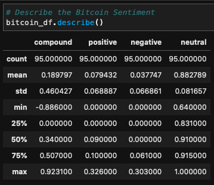
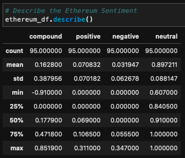
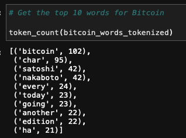
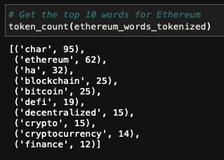
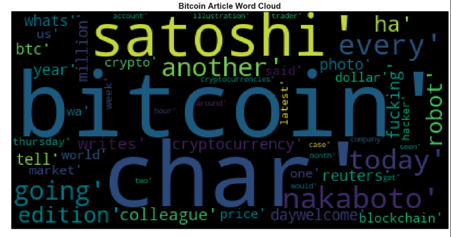
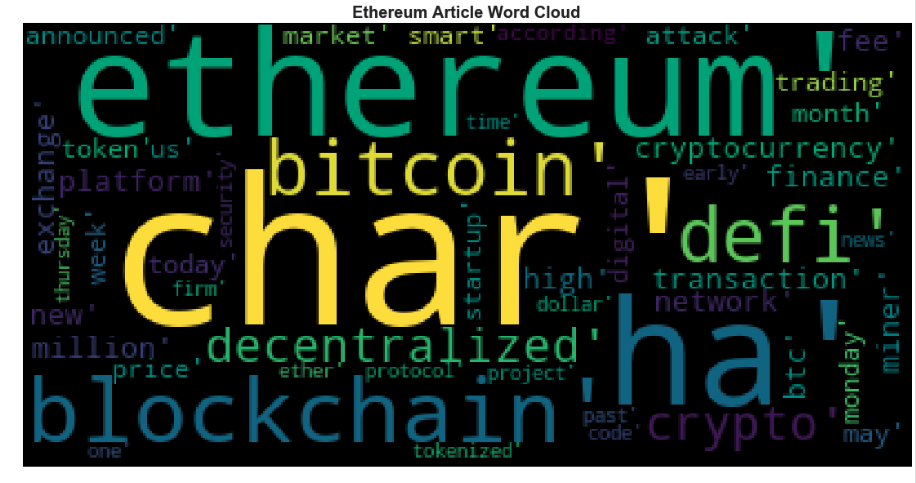

# tales_from_the_crypto

## Sentiment Analysis

 

NLTK’s sentiment analyzer found that, on average, Bitcoin article texts scores 
were slightly more positive and more negative, but had slightly lower neutral 
scores than Ethereum article texts.  The average Bitcoin positive, negative, 
and neutral scores were 0.079, 0.038, and 0.883, respectively.  The average 
Ethereum positive, negative, and neutral scores were 0.071, 0.032, and 0.897, 
respectively.  Furthermore, Bitcoin’s mean compound score of 0.190 was slightly 
higher than Ethereum’s mean compound score (0.163).

On an individual text level, a Bitcoin text had the highest positive rating out 
of all Bitcoin and Ethereum texts—0.326.  Additionally, an Ethereum text had 
the highest overall negative sentiment score—0.347.  Ethereum’s average 
negative score was slightly lower than Bitcoin’s average negative score, so it 
appears there is a certain amount of skew present in Ethereum’s negative scores.

## Word Clouds

 

The words generated by the word tokenizer for the word clouds are taken from all 
Bitcoin/Ethereum article texts from the newsapi.  Each article text is taken 
from the ‘content’ dictionary from the newsapi.  Upon review, it does not seem 
like the full text is included in the dictionary.  As a result, “char’” appears 
as one of the most comment words for both Bitcoin and Ethereum articles, and 
has a prominent position in the word clouds.

